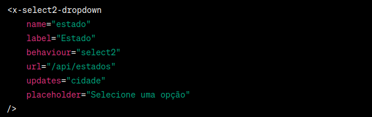

# Laravel Select2 Component
Este repositório contém um projeto Laravel que implementa um componente de dropdown dinâmico utilizando a biblioteca Select2. O componente facilita a criação de campos de seleção que carregam dados dinamicamente via API, sendo particularmente útil para campos dependentes, como seleção de estado/cidade.


## Características

Laravel Sail: Configurado para usar o Laravel Sail, facilitando a instalação e execução do projeto em um ambiente Docker.

Componente Select2: Implementa um componente Laravel para renderizar campos de seleção com busca dinâmica e dependência de campos.

API Integrada: Inclui exemplos de endpoints da API para servir dados para os campos de seleção.

## Instalação do Projeto

Ambiente de desenvolvimento local

Pré-requisitos

- Docker,
- Docker-compose,
- Git


1 - Clone este repositório em sua máquina local usando o comando:
````
git clone https://github.com/jeancarloscharao/laravel-select2-component.git
````

#
2 - Entre na pasta do projeto
````
cd laravel-select2-component
````
#
3 - Dentro da pasta do projeto execute o comando para instalar as dependências da aplicação:
````
docker run --rm \
    -u "$(id -u):$(id -g)" \
    -v "$(pwd):/var/www/html" \
    -w /var/www/html \
    laravelsail/php82-composer:latest \
    composer install --ignore-platform-reqs
````
#    
4 - Copie o env.local para .env com o comando:
````
cp env.local .env
````

#
5 - Execute o comando para subir os containers
````
./vendor/bin/sail up -d  
````
#
6 - Crie as tabelas
````
 ./vendor/bin/sail php artisan migrate
````
#
7 - Crie os resgistros iniciais
````
 ./vendor/bin/sail php artisan db:seed
````

#
8 - Para acessar o projeto abra o navegador no link:
````
http://localhost
````
#


### Criando atalho no linux para sail

Este passo é apenas um plus para usar sail sem precisar passar todo o caminho da pasta.

Vamos criar um atalho de 

./vendor/bin/sail 

para 

sail
#
1 - Abra o terminal e execute o seguinte comando para editar o arquivo .bashrc:
````
nano ~/.bashrc
````
#
2 - Role para a parte inferior do arquivo e adicione a seguinte linha:
````
alias sail='[ -f sail ] && sh sail || sh vendor/bin/sail'
````
#
3 - Salve o arquivo pressionando Ctrl+O e em seguida pressionando Enter. Depois, saia do editor Nano pressionando Ctrl+X.
#
4 - Ative o novo alias executando o seguinte comando:
````
source ~/.bashrc
````

## Testando o Componente
Ao acessar http://localhost/, você verá um formulário com os campos de seleção implementados pelo componente Select2.

Escolha um estado para ver as cidades correspondentes, e uma cidade para ver os bairros correspondentes.

## Estrutura do Projeto
Componente: O componente Select2 está localizado em ["laravel-select2-component/app/View/Components/Select2Dropdown.php"] e ["laravel-select2-component/resources/views/components/select2-dropdown.blade.php"].

Controller: O Select2Controller gerencia as requisições da API e está localizado em ["laravel-select2-component/app/Http/Controllers/Select2Controller.php"].

Rota de Teste: A rota de teste está configurada no arquivo de rotas web e aponta para a view que contém o formulário de exemplo.